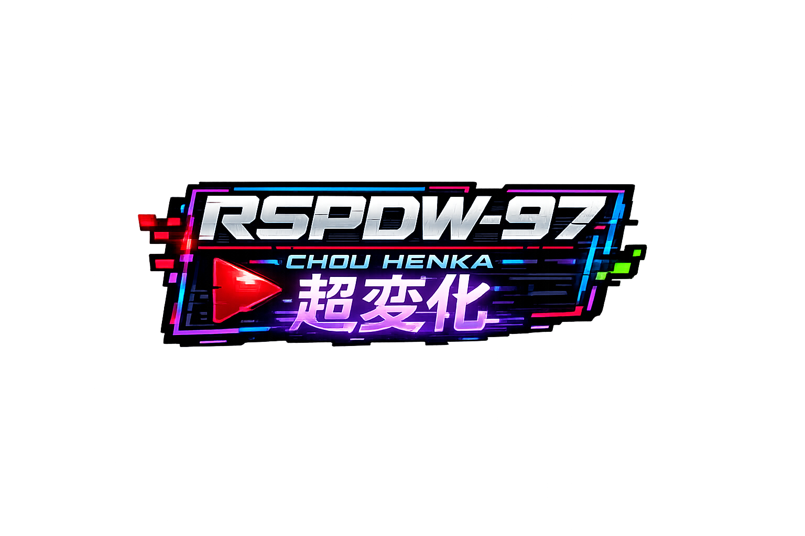
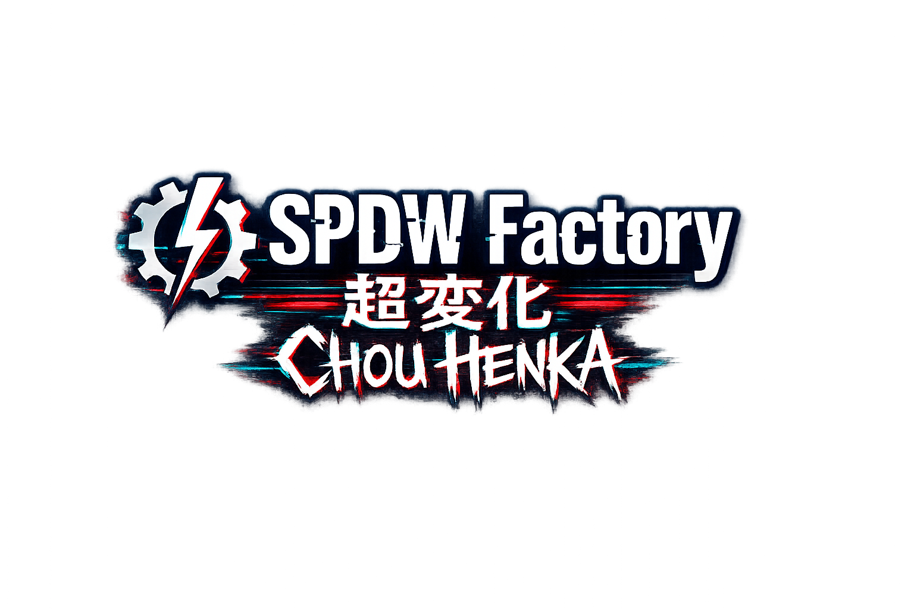

<div align="center">

<!-- APP ICON -->


# ⚡ Rt:Terminal I.D.
### *RetroFW 2.3 Terminal Emulator*

[](https://github.com/spdw-factory/rt-terminal-id)
[](https://python.org)
[](https://retrofw.github.io)
[]()

**Developed by SPDW Factory for the RSPDW Chou Henka Project**

<!-- SPDW FACTORY LOGO -->


</div>

---

## 🇬🇧 ENGLISH

### Overview

**Rt:Terminal I.D.** is a full-featured terminal emulator for RetroFW 2.3 devices (RS-97, LDK, RG-300, etc.). It delivers an authentic shell experience with on-screen keyboard, multi-session support, persistent JSON command saving, and 6 visual themes.

> *"Symmetric linear printing. JSON command saving. Multi-session."*

<!-- RSPDW LOGO -->
<div align="center">

</div>

### Features

| Feature | Description |
|---------|-------------|
| 🎮 **On-Screen Keyboard** | 3 layouts (abc/ABC/sym) with D-PAD navigation |
| 💾 **JSON Save System** | Save, edit and delete custom commands |
| 🎨 **6 Themes** | Cyan Neo, Matrix G, Amber Box, Crimson G, Void Blue, Solarized |
| 🔄 **Multi-Session** | Create and switch between multiple shell sessions |
| 📐 **Symmetric Print Width** | Adjustable terminal width (150-316px) |
| 🔤 **Custom Fonts** | TTF support from `fonts/` folder |
| 🌐 **Bilingual** | Full IT / EN localization |
| 💡 **Blinking Cursor** | Visual feedback in prompt |
| 📊 **System Monitor** | Real-time CPU/RAM info in header |
| ⚡ **Pre-loaded Commands** | 20 system commands + unlimited user slots |

### Screenshots

<!-- SCREENSHOT 1 PLACEHOLDER -->
<!--  -->
<p><em>Main terminal screen — Cyan Neo theme</em></p>

<!-- SCREENSHOT 2 PLACEHOLDER -->
<!--  -->
<p><em>Options menu with live settings</em></p>

<!-- SCREENSHOT 3 PLACEHOLDER -->
<!--  -->
<p><em>Command almanac with user and system commands</em></p>

### Controls

```
┌─────────────────────────────────────────────────────────┐
│  DPAD      → Navigate keyboard / menu / almanac        │
│  A (CTRL)  → Select / Confirm / Execute                │
│  B (ALT)   → Backspace / Cancel / Close                │
│  Y (SHIFT) → Hold + ↑↓ = Scroll log  │  Tap = Toggle OSK│
│  X (S)     → Edit user command (in Almanac)            │
│  L (TAB)   → Cycle Almanac commands                    │
│  R (BKSP)  → Change keyboard layout (abc/ABC/sym)      │
│  START     → Open options menu                         │
│  SELECT    → Exit application                          │
└─────────────────────────────────────────────────────────┘
```

### Menu Options
- **Session** — Switch active terminal session
- **New Session** — Create new shell session
- **Log Size** — Font size 11-15pt
- **Print Width** — Terminal width 150-316px
- **Theme** — 6 color themes
- **Language** — IT / EN
- **Almanac** — Command list (A=execute, Y=delete, X=edit)
- **Save Command** — Add custom command to JSON
- **Load Font** — Select custom TTF font
- **About** — Credits

### Installation

#### Method 1: OPK (Recommended)
```bash
mksquashfs rt_terminal_id_v4/ RtTerminalID.opk -all-root -noappend
cp RtTerminalID.opk /media/data/apps/
```

#### Method 2: Install Script
```bash
cd rt_terminal_id_v4/
sh install.sh
```

#### Method 3: Manual
```bash
mkdir -p /home/retrofw/.rspdw/rt_terminal/fonts
cp main.py rt_tid.json icon.png /home/retrofw/.rspdw/rt_terminal/
python2 /home/retrofw/.rspdw/rt_terminal/main.py
```

### File Structure

```
rt_terminal_id_v4/
├── main.py              # Main application (Python 2.7)
├── rt_tid.json          # Config + user commands
├── icon.png             # 32x32 RetroFW icon
├── default.gcw0.desktop # OPK launcher
├── manual.txt           # User manual
├── install.sh           # Installation script
├── README.md            # This file
└── fonts/               # Custom TTF fonts directory
```

### JSON Configuration

```json
{
    "theme": "Cyan Neo",
    "font_size": 13,
    "language": "IT",
    "font_file": "default",
    "print_width": 308,
    "almanacco": [
        {
            "name": "My Custom Command",
            "description": "What this command does",
            "cmd": "echo 'Hello RetroFW!'"
        }
    ]
}
```

| Field | Type | Default | Description |
|-------|------|---------|-------------|
| `theme` | string | `"Cyan Neo"` | UI color theme |
| `font_size` | int | `13` | Terminal font size (11-15) |
| `language` | string | `"IT"` | UI language (IT/EN) |
| `font_file` | string | `"default"` | TTF from `fonts/` or `"default"` |
| `print_width` | int | `308` | Print area width in pixels (150-316) |
| `almanacco` | array | `[]` | Custom commands array |

### Themes

| Name | Palette | Vibe |
|------|---------|------|
| **Cyan Neo** | Cyan / Magenta / Dark | Classic cyberpunk |
| **Matrix G** | Green / Dark | Hacker terminal |
| **Amber Box** | Orange / Brown | Retro monitor |
| **Crimson G** | Red / Dark | Alert system |
| **Void Blue** | Blue / Navy | Deep space |
| **Solarized** | Teal / Magenta | Elegant editor |

### Requirements

- **Device**: RS-97, LDK, RG-300 or RetroFW 2.3 compatible
- **Python**: 2.7 (included in RetroFW)
- **Pygame**: SDL 1.2 (included in RetroFW)
- **RAM**: ~5MB runtime
- **Storage**: ~50KB installation

### Troubleshooting

| Issue | Solution |
|-------|----------|
| Crash and errors | Check the log file in /home/retrofw/rspdw_lab/black_box` |
| Font won't load | Check `.ttf` is in `fonts/` folder |
| Corrupted JSON | Delete `rt_tid.json`, it will be recreated with defaults |
| Commands won't execute | Check shell permissions (`chmod +x main.py`) |
| Black screen | Check SDL variables: `unset SDL_VIDEODRIVER` |

### Changelog

#### v4.0 (2026-06-19)
- ✅ Complete JSON command save system
- ✅ User command editor (add/edit/delete)
- ✅ Persistent JSON configuration
- ✅ 2 new themes (Void Blue, Solarized)
- ✅ Blinking cursor
- ✅ Session indicator in header
- ✅ Directory feedback after `cd`
- ✅ Visual status messages
- ✅ Custom 32x32 SPDW icon
- ✅ Complete OPK structure
- ✅ Fixed Y-key OSK toggle
- ✅ Improved unicode handling

#### v2.2 (2026-06)
- Symmetric linear printing
- Smart wrapping
- 4 base themes
- Multi-session
- Command almanac

_______________________________________________________________________________________________

## 🇮🇹 ITALIANO

### Panoramica

**Rt:Terminal I.D.** è un emulatore terminale completo per dispositivi RetroFW 2.3 (RS-97, LDK, RG-300, ecc.). Offre un'esperienza shell autentica con tastiera virtuale, multi-sessione, salvataggio comandi JSON persistente e 6 temi visivi.

> *"Stampa lineare simmetrica. Salvataggio comandi JSON. Multi-sessione."*

<!-- RSPDW LOGO -->
<div align="center">

</div>

### Funzionalità

| Funzionalità | Descrizione |
|--------------|-------------|
| 🎮 **Tastiera Virtuale** | 3 layout (abc/ABC/sym) con navigazione D-PAD |
| 💾 **Sistema Salvataggio JSON** | Salva, modifica ed elimina comandi personalizzati |
| 🎨 **6 Temi** | Cyan Neo, Matrix G, Amber Box, Crimson G, Void Blue, Solarized |
| 🔄 **Multi-Sessione** | Crea e switcha tra multiple sessioni shell |
| 📐 **Larghezza Simmetrica** | Larghezza terminale regolabile (150-316px) |
| 🔤 **Font Personalizzati** | Supporto TTF dalla cartella `fonts/` |
| 🌐 **Bilingue** | Localizzazione completa IT / EN |
| 💡 **Cursore Lampeggiante** | Feedback visivo nel prompt |
| 📊 **Monitor di Sistema** | Info CPU/RAM in tempo reale nell'header |
| ⚡ **Comandi Pre-caricati** | 20 comandi di sistema + slot illimitati utente |

### Screenshot

<!-- SCREENSHOT 1 PLACEHOLDER -->
<!--  -->
<p><em>Schermata terminale principale — tema Cyan Neo</em></p>

<!-- SCREENSHOT 2 PLACEHOLDER -->
<!--  -->
<p><em>Menu opzioni con impostazioni live</em></p>

<!-- SCREENSHOT 3 PLACEHOLDER -->
<!--  -->
<p><em>Almanacco comandi con comandi utente e di sistema</em></p>

### Controlli

```
┌─────────────────────────────────────────────────────────┐
│  DPAD      → Naviga tastiera / menu / almanacco        │
│  A (CTRL)  → Seleziona / Conferma / Esegui             │
│  B (ALT)   → Backspace / Annulla / Chiudi              │
│  Y (SHIFT) → Hold + ↑↓ = Scroll log  │  Tap = Toggle OSK│
│  X (S)     → Modifica comando utente (in Almanacco)    │
│  L (TAB)   → Scorri comandi dell'Almanacco             │
│  R (BKSP)  → Cambia layout tastiera (abc/ABC/sym)    │
│  START     → Apri menu opzioni                         │
│  SELECT    → Esci dall'applicazione                    │
└─────────────────────────────────────────────────────────┘
```

### Opzioni Menu
- **Sessione** — Cambia sessione terminale attiva
- **Nuova Sessione** — Crea nuova sessione shell
- **Dimensione Log** — Font size 11-15pt
- **Larghezza Area** — Larghezza stampa 150-316px
- **Tema** — 6 temi colorati
- **Lingua** — IT / EN
- **Almanacco** — Lista comandi (A=esegui, Y=elimina, X=modifica)
- **Salva Comando** — Aggiungi comando personalizzato al JSON
- **Carica Font** — Seleziona font TTF personalizzato
- **Informazioni** — Crediti

### Installazione

#### Metodo 1: OPK (Consigliato)
```bash
mksquashfs rt_terminal_id_v4/ RtTerminalID.opk -all-root -noappend
cp RtTerminalID.opk /media/data/apps/
```

#### Metodo 2: Script Installazione
```bash
cd rt_terminal_id_v4/
sh install.sh
```

#### Metodo 3: Manuale
```bash
mkdir -p /home/retrofw/.rspdw/rt_terminal/fonts
cp main.py rt_tid.json icon.png /home/retrofw/.rspdw/rt_terminal/
python2 /home/retrofw/.rspdw/rt_terminal/main.py
```

### Struttura File

```
rt_terminal_id_v4/
├── main.py              # Applicazione principale (Python 2.7)
├── rt_tid.json          # Configurazione + comandi utente
├── icon.png             # Icona 32x32 per RetroFW
├── default.gcw0.desktop # Launcher OPK
├── manual.txt           # Manuale utente
├── install.sh           # Script installazione
├── README.md            # Questo file
└── fonts/               # Directory font TTF personalizzati
```

### Configurazione JSON

```json
{
    "theme": "Cyan Neo",
    "font_size": 13,
    "language": "IT",
    "font_file": "default",
    "print_width": 308,
    "almanacco": [
        {
            "name": "Mio Comando",
            "description": "Cosa fa questo comando",
            "cmd": "echo 'Ciao RetroFW!'"
        }
    ]
}
```

| Campo | Tipo | Default | Descrizione |
|-------|------|---------|-------------|
| `theme` | string | `"Cyan Neo"` | Tema colore interfaccia |
| `font_size` | int | `13` | Dimensione font terminale (11-15) |
| `language` | string | `"IT"` | Lingua interfaccia (IT/EN) |
| `font_file` | string | `"default"` | File TTF da `fonts/` o `"default"` |
| `print_width` | int | `308` | Larghezza area stampa in pixel (150-316) |
| `almanacco` | array | `[]` | Array comandi personalizzati |

### Temi

| Nome | Palette | Atmosfera |
|------|---------|-----------|
| **Cyan Neo** | Cyan / Magenta / Scuro | Cyberpunk classico |
| **Matrix G** | Verde / Scuro | Terminale hacker |
| **Amber Box** | Arancione / Marrone | Monitor retro |
| **Crimson G** | Rosso / Scuro | Sistema allarme |
| **Void Blue** | Blu / Navy | Spazio profondo |
| **Solarized** | Teal / Magenta | Editor elegante |

### Requisiti

- **Dispositivo**: RS-97, LDK, RG-300 o compatibile RetroFW 2.3
- **Python**: 2.7 (incluso in RetroFW)
- **Pygame**: SDL 1.2 (incluso in RetroFW)
- **RAM**: ~5MB in esecuzione
- **Storage**: ~50KB installazione

### Risoluzione Problemi

| Problema | Soluzione |
|----------|-----------|
| Crash o errori | Controlla file Log in /home/retrofw/rspdw_lab/black_box` |
| Font non carica | Verifica che il file `.ttf` sia in `fonts/` |
| JSON corrotto | Cancella `rt_tid.json`, verrà ricreato con default |
| Comandi non eseguono | Verifica permessi shell (`chmod +x main.py`) |
| Schermo nero | Controlla variabili SDL: `unset SDL_VIDEODRIVER` |

### Changelog

#### v4.0 (2026-06-19)
- ✅ Sistema salvataggio comandi JSON completo
- ✅ Editor comandi utente (aggiungi/modifica/elimina)
- ✅ Configurazione persistente in JSON
- ✅ 2 nuovi temi (Void Blue, Solarized)
- ✅ Cursore lampeggiante
- ✅ Indicatore sessione nell'header
- ✅ Feedback directory dopo `cd`
- ✅ Messaggi di stato visivi
- ✅ Icona 32x32 SPDW custom
- ✅ Struttura OPK completa
- ✅ Bugfix Y-key toggle OSK
- ✅ Migliorata gestione unicode

#### v2.2 (2026-06)
- Stampa lineare simmetrica
- Wrap intelligente
- 4 temi base
- Multi-sessione
- Almanacco comandi

---

## 👥 Credits / Crediti

<div align="center">

<!-- SPDW SYMBOL -->


**SPDW Factory** — Development

<!-- MINORU SYMBOL -->


**sirpipsduwilson** — Project Lead  
**Part of "SPDW"** — Crossdimensional Underground Cyberpunk Entertainment Protocol  
**with the participation of: Minoru^7** — RI (pain in the a**) Protocol

<!-- RSPDW LOGO -->


*Part of the **RSPDW Chou Henka Project***

</div>

---

## 📄 License / Licenza

```
Rt:Terminal I.D. v4.0
Copyright (c) 2026 SPDW Factory

Free for personal use.
Part of the RSPDW Chou Henka Project.

Redistribution and use in source and binary forms, with or without
modification, are permitted provided that the above copyright notice
and this permission notice appear in all copies.

THE SOFTWARE IS PROVIDED "AS IS", WITHOUT WARRANTY OF ANY KIND.
```

---

<div align="center">

**[⬇ Download Latest Release](https://github.com/spdw-factory/rt-terminal-id/releases)**  
**[🐛 Report Issue / Segnala Problema](https://github.com/spdw-factory/rt-terminal-id/issues)**  
**[💬 Discussions / Discussioni](https://github.com/spdw-factory/rt-terminal-id/discussions)**

*Made with ⚡ by SPDW Factory for the RetroFW community*

</div>
